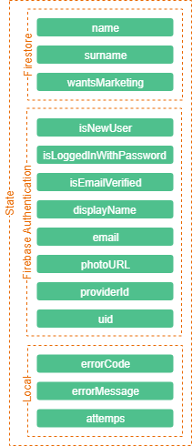
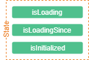

# State Management

- [Overview](#overview)
- [User Module](#user-module)
- [Core Module](#core-module)

## Overview

The [vuex store](https://vuex.vuejs.org) is divided in two modules, [core](#core-module) and [auth](#auth-module).

All Firebase specific code, including all method calls and the conciliation of Firebase Authentication data and [Firestore User Document](firestore.md) are stored and handled by the [auth module](#auth-module).

Application global state of loading and initialization are stored in the [core](#core-module) module. The application initialization occurs right after both, vue and firebase apps initialize and the loading state remains true until that.

## User Module

The image above describes the three different types of data that we store in our user state. Firestore data, Firebase Authentication data and local data. Below you see a description of each of this data types:

- Firestore Data: information retrieved from the user document under Firestore `/users/${uid}`.
  - Has _read/write_ access for the owner. [See Firestore rules](/firestore.rules)
- Firebase Authentication Data: stored in a place out of our control and provided by the `auth` api of firebase.
  - Has _read_ access in the majority of the properties, except by email, displayName and photoURL, that can be changed by request.
- Local data: normal data used as control for some logics.
  - Has _read/write_ access.

In additional to the state, we have the [actions](https://vuex.vuejs.org/guide/actions.html) and the [getters](https://vuex.vuejs.org/guide/getters.html). You can have a [look at the available getters here](/src/store/auth/getters.ts#L4) and also at the [available actions](/src/store/auth/actions.ts#L6).

## Core Module

The core module is used to control application global behaviors such as full-page loading and initialization state.

In additional to the state, we also have the [actions](https://vuex.vuejs.org/guide/actions.html) and the [getters](https://vuex.vuejs.org/guide/getters.html). You can have a [look at the available getters here](/src/store/core/index.ts) and also at the [available actions](/src/store/core/index.ts).
